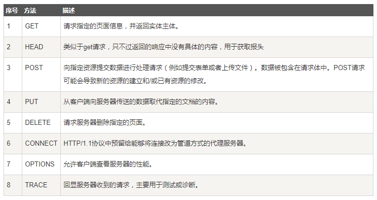
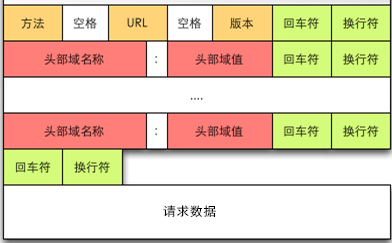
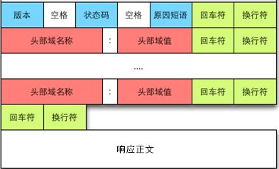
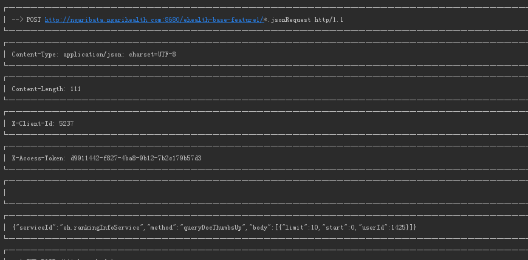
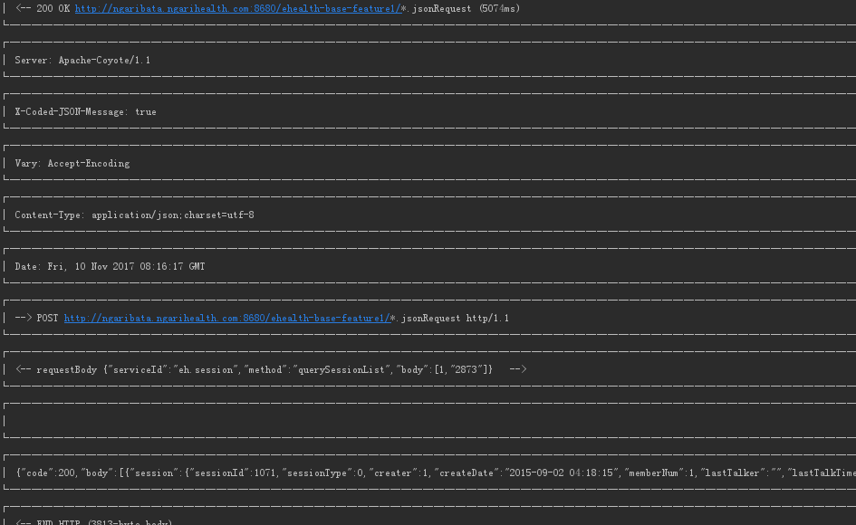

Android 网络请求
=================
[TOC]


<a href="#l1">常用的Http请求方法</a>

[HTTP/2](#l2)

<a href="#l3">Okhttp</a>

[Retrofit](#l4)

### URL简介
URL（Uniform Resource Locator）是统一资源定位符的简称，有时候也被俗称为网页地址（网址），如同是网络上的门牌，是因特网上标准的资源的地址

通用的格式：schema://host[:port#]/path/…/[?query=string][#anchor]

|**名称**|**功能**|
|---|----|
|schema|访问服务器以获取资源时要使用哪种协议，比如，http，https 和 FTP 等|
|host|HTTP 服务器的 IP 地址或域名|
|port#|HTTP 服务器的默认端口是 80，这种情况下端口号可以省略，如果使用了别的端口，必须指明，例如www.cnblogs.com：8080|
|path|访问资源的路径|
|query=string|发给 http 服务器的数据
|anchor|锚

https://github.com/guodongxiaren/README#%E5%9B%BE%E7%89%87


### 请求方法

HTTP 的请求方法共有 8 个，HTTP 协议 1.0 版本中定义了GET、POST、HEAD 这 3 个方法，1.1 版本时又新增了PUT、DELETE、TRACE、CONNECT、OPTION 这 5 个方法。其中最常用的是 GET 和 POST。



### 请求报文

HTTP 请求报文的一般格式如图所示：



### 响应报文


响应报文包含状态行、响应报头、空行和响应正文 4 个部分。空行表示响应头部和正文的分隔，相应正文则表示服务器返回的资源的内容，主要介绍一下状态行和 HTTP 协议中的消息报头（请求报头和响应报头都属于它的一个分类，所以放在一起介绍）。

### 状态行

状态行依次包括 HTTP 版本、状态码以及该状态码对应的原因短语，示例如下：

>HTTP/1.1 200 OK

HTTP 状态码由三个十进制数字组成，第一个十进制数字定义了状态码的类型，后两个数字没有分类的作用。HTTP状态码共分为5种类型：

* 100~199 ： 信息，服务器收到请求，需要请求者继续执行操作
* 200~299： 成功，操作被成功接收并处理
* 300~399 ： 重定向，需要进一步的操作以完成请求
* 400~499 ： 客户端错误，请求包含语法错误或无法完成请求
* 500~599 ： 服务器错误，服务器在处理请求的过程中发生了错误

常见的HTTP状态码有：

* 200 - OK 请求成功
* 301 - Moved Permanently 资源（网页等）被永久转移到其它URL
* 302 - Moved Temporarily 请求临时重定向
* 304 - Not Modified 缓存有效可以继续使用
* 400 - Bad Request 由于客户端请求有语法错误，不能被服务器所理解。
* 401 - Unauthorized 请求未经授权。这个状态代码必须和WWW-Authenticate报头域一起使用
* 403 - Forbidden 服务器收到请求，但是拒绝提供服务。服务器通常会在响应正文中给出不提供服务的原  因
* 404 - Not Found 请求的资源（网页等）不存在
* 409 - 对当前资源状态，请求不能完成
* 500 - Internal Server Error 内部服务器错误
* 503 - Service Unavailable 服务器当前不能够处理客户端的请求，在一段时间之后，服务器可能会恢复正常。
* 504 - Gateway Timeout/网关超时


## HTTP的消息报头

消息报头可以分为通用报头、请求报头、响应报头和实体报头。以键值对的形式存在，每行一对，名字和值之间用 “：” 来进行分隔。

### 通用报头
通用报头既能出现在请求报头也能出现在响应报头中。  

* Date ： 发送消息的日期和时间
* Connection ： 允许发送指定连接的选项。例如指定连接是连续，或者指定 “close” 选项，通知服务器，在响应完成后，关闭连接
* Cache-Control ： 用于指定缓存指令，缓存指令是单向的（响应中出现的缓存指令在请求中未必会出现），且是独立的（一个消息的缓存指令不会影响另一个消息处理的缓存机制）

### 请求报头

请求报头允许客户端向服务器端传递请求的附加信息以及客户端自身的信息。
常见的请求报头有：

* Host ： 发送请求时，该报头域是必需的。Host 请求报头域主要用于指定被请求资源的 Internet 主机和端口号，它通常从 HTTP URL 中提取出来。
* User-Agent ： 允许客户端将它的操作系统、浏览器和其它属性告诉服务器。
* Accept ： 用于指定客户端接受哪些类型的信息。例如Accept：image/gif，表明客户端希望接受 GIF 图象格式的资源；Accept：text/html，表明客户端希望接受 html 文本。
* Accept-Charset ： 用于指定客户端接受的字符集。
* Accept-Encoding ： 用于指定可接受的内容编码。
* Accept-Language ： 用于指定一种自然语言。例如 Accept-Language:zh-cn 表示支持中文。
* Authorization ： 请求报头域主要用于证明客户端有权查看某个资源。当浏览器访问一个页面时，如果收到服务器的响应代码为 401（未授权），可以发送一个包含 Authorization 请求报头域的请求，要求服务器对其进行验证。

### 响应报头

响应报头用于服务器向客户端发送信息。
常见的响应报头有：

* Location ： 用于重定向接受者到一个新的位置，常用在更换域名的时候。
* Server ： 包含了服务器用来处理请求的软件信息，与User-Agent请求报头域是相对应的。
* WWW-Authenticate ： 必须被包含在 401（未授权的）响应消息中，客户端收到 401 响应消息时候，并发送 Authorization 报头域请求服务器对其进行验证时，服务端响应报头就包含该报头域。

### 实体报头

请求和响应消息都可以传送一个实体。实体报头定义了关于实体正文和请求所标识的资源的元信息。
常见的实体报头有：

* Content-Encoding ： 被用作媒体类型的修饰符，它的值指示了已经被应用到实体正文的附加内容的编码。
* Content-Language ： 描述了资源所用的自然语言。
* Content-Length ： 用于指明实体正文的长度，以字节方式存储的十进制数字来表示。
* Content-Type ： 实体报头域用语指明发送给接收者的实体正文的媒体类型。
* Last-Modified ： 用于指示资源的最后修改日期和时间。

### 持久连接

* Http1.0版 

   默认每个请求/应答客户和服务器都要新建一个连接，完成之后立即断开连接（HTTP协议为无连接的协议），通过请求头中添加Connection: keep-alive来持久连接、连接重用。

* http1.1版本 

   默认情况下所有连接都被保持，可以通过请求头中添加Connection: close来关闭
   一个Request完成后，客户端和服务器之间用于传输HTTP数据的TCP连接会关闭，当客户端再次发送Request，需要重新建立TCP连接。

以下是一个响应报文的实例：

>HTTP/1.1 304 Not Modified  

>Date: Thu, 12 Oct 2017 09:20:27 GMT

>Via: 1.1 varnish
>
>Cache-Control: max-age=600
>
>Expires: Thu, 12 Oct 2017 09:02:02 GMT
> 
>Age: 0
>
>Connection: keep-alive
>
>X-Served-By: cache-hkg17934-HKG
>
>X-Cache: MISSX-Cache-Hits: 0
>
>X-Timer: S1507800028.883579,VS0,VE164
>
>Vary: Accept-Encoding
>
>X-Fastly-Request-ID: 17fc09b064ce9669f38931c159ec01384cc3f8de

这是app log 输出
请求


返回


## 常用的Http请求方法<a name="l1"/>

### get请求

GET用于信息获取，而且应该是安全的 和 幂等的。

所谓安全的意味着该操作用于获取信息而非修改信息。换句话说，GET 请求一般不应产生副作用。就是说，它仅仅是获取资源信息，就像数据库查询一样，不会修改，增加数据，不会影响资源的状态。

幂等的意味着对同一URL的多个请求应该返回同样的结果。

### post请求

HTTP 协议中规定 POST 提交的数据必须在 body 部分中，但是协议中没有规定数据使用哪种编码方式或者数据格式。实际上，开发者完全可以自己决定消息主体的格式，只要最后发送的 HTTP 请求满足上面的格式就可以。

但是，数据发送出去，还要服务端解析成功才有意义。一般服务端语言如 php、python 等，以及它们的 framework，都内置了自动解析常见数据格式的功能。服务端通常是根据请求头（headers）中的 Content-Type 字段来获知请求中的消息主体是用何种方式编码，再对主体进行解析。所以说到 POST 提交数据方案，包含了 Content-Type 和消息主体编码方式两部分。下面就正式开始介绍它们：

* application/x-www-form-urlencoded

这是最常见的 POST 数据提交方式。浏览器的原生 <form> 表单，如果不设置 enctype 属性，那么最终就会以 application/x-www-form-urlencoded 方式提交数据。上个小节当中的例子便是使用了这种提交方式。可以看到 body 当中的内容和 GET 请求是完全相同的。

* multipart/form-data

这又是一个常见的 POST 数据提交的方式。我们使用表单上传文件时，必须让 <form> 表单的 enctype 等于 multipart/form-data。直接来看一个请求示例：

```
POST http://www.example.com HTTP/1.1
Content-Type:multipart/form-data; boundary=----WebKitFormBoundaryrGKCBY7qhFd3TrwA

------WebKitFormBoundaryrGKCBY7qhFd3TrwA
Content-Disposition: form-data; name="text"

title
------WebKitFormBoundaryrGKCBY7qhFd3TrwA
Content-Disposition: form-data; name="file"; filename="chrome.png"
Content-Type: image/png

PNG ... content of chrome.png ...
------WebKitFormBoundaryrGKCBY7qhFd3TrwA--
```
这个例子稍微复杂点。首先生成了一个 boundary 用于分割不同的字段，为了避免与正文内容重复，boundary 很长很复杂。然后 Content-Type 里指明了数据是以 multipart/form-data 来编码，本次请求的 boundary 是什么内容。消息主体里按照字段个数又分为多个结构类似的部分，每部分都是以 --boundary 开始，紧接着是内容描述信息，然后是回车，最后是字段具体内容（文本或二进制）。如果传输的是文件，还要包含文件名和文件类型信息。消息主体最后以 --boundary-- 标示结束。关于 multipart/form-data 的详细定义，请前往 RFC1867 查看（或者相对友好一点的 MDN 文档）。

这种方式一般用来上传文件，各大服务端语言对它也有着良好的支持。

上面提到的这两种 POST 数据的方式，都是浏览器原生支持的，而且现阶段标准中原生 <form> 表单也只支持这两种方式（通过 <form> 元素的 enctype 属性指定，默认为 application/x-www-form-urlencoded。其实 enctype 还支持 text/plain，不过用得非常少）。

随着越来越多的 Web 站点，尤其是 WebApp，全部使用 Ajax 进行数据交互之后，我们完全可以定义新的数据提交方式，例如 application/json，text/xml，乃至 application/x-protobuf 这种二进制格式，只要服务器可以根据 Content-Type 和 Content-Encoding 正确地解析出请求，都是没有问题的。

### Head 请求

HEAD请求常常被忽略，但是能提供很多有用的信息，特别是在有限的速度和带宽下。主要有以下特点：

1、只请求资源的首部；

2、检查超链接的有效性；

3、检查网页是否被修改；

4、多用于自动搜索机器人获取网页的标志信息，获取rss种子信息，或者传递安全认证信息等

实例，多线程下载时候可以请求资源文件大小，方便分割下载

### Http缓存

目前http缓存只对Get请求起作用
控制缓存的Header有如下

- 强缓存 缓存命中返回200，不会请求服务器

  * Expires（已过时，会被Cache-Control覆盖）
    Expires的值为服务端返回的到期时间，即下一次请求时，请求时间小于服务端返回的到期时间，直接使用缓存数据。
  * Cache-Control
    Cache-Control 是最重要的规则。常见的取值有private、public、no-cache、max-age，no-store，默认为private。

     * private:        客户端可以缓存
     * public:         客户端和代理服务器都可缓存（前端的同学，可以认为public和private是一样的）
     * max-age=xxx:   缓存的内容将在 xxx 秒后失效
     * no-cache:      需要使用对比缓存来验证缓存数据）
     * no-store:      所有内容都不会缓存，强制缓存，对比缓存都不会触发
   
- 对比缓存，也称为协商缓存
   协商缓存就是由服务器来确定缓存资源是否可用，所以要请求服务器
   在缓存生效时，服务器返回状态码为304，并且报文大小和请求时间大大减少。服务端在进行标识比较后，只返回header部分，通过状态码通知客户端使用缓存，不再需要将报文主体部分返回给客户端

   1. 通过修改时间判断，一般客户端都会携带If-Modified-Since询问服务缓存是否可用，部分客户端
   是根据响应头header中Date和 Last-Modified的差值10%作为缓存时间周期，这期间不会请求网络，只访问缓存。缓存有效返回304。
	
     * Last-Modified 只存在响应头 告诉客户端资源的最后修改时间
     * If-Modified-Since 只存在请求头，值来源于缓存中响应头Last-Modified的值 
     
   2. 通过唯一标示是否匹配判断，类似java中比较hashcode判断对象是否相同,Etag优先级高于 Last-Modified，每次都会请求网络，缓存可用时返回304和响应头，同时响应body中中无数据
     * Etag 当前资源在服务器的唯一标识（生成规则由服务器决定），只存在响应头中
     * If-None-Match 请求的时候加入的header，来源于缓存的响应头Etag值，只存在请求头中
   


## HTTP/2<a name="l2"/>

2009年，谷歌公开了自行研发的 SPDY 协议，主要解决 HTTP/1.1 效率不高的问题。
这个协议在Chrome浏览器上证明可行以后，就被当作 HTTP/2 的基础，主要特性都在 HTTP/2 之中得到继承。
2015年，HTTP/2 发布。它不叫 HTTP/2.0，是因为标准委员会不打算再发布子版本了，下一个新版本将是 HTTP/3。

特性

1. 二进制协议
   HTTP/2 则是一个彻底的二进制协议，头信息和数据体都是二进制，并且统称为"帧"（frame）：头信息帧和数据帧。
   二进制协议的一个好处是，可以定义额外的帧。HTTP/2 定义了近十种帧，为将来的高级应用打好了基础。如果使用文本实现这种功能，解析数据将会变得非常麻烦，二进制解析则方便得多。
2. 多工

   HTTP/2 复用TCP连接，在一个连接里，客户端和浏览器都可以同时发送多个请求或回应，而且不用按照顺序一一对应，这样就避免了"队头堵塞"。

3. 连接共享，多路服用
   客户端和服务器可以把HTTP 消息分解为互不依赖的帧，然后乱序发送，最后再在另一端把它们重新组合起来

   因为 HTTP/2 的数据包是不按顺序发送的，同一个连接里面连续的数据包，可能属于不同的回应。因此，必须要对数据包做标记，指出它属于哪个回应。

   HTTP/2 将每个请求或回应的所有数据包，称为一个数据流（stream）。每个数据流都有一个独一无二的编号。数据包发送的时候，都必须标记数据流ID，用来区分它属于哪个数据流。另外还规定，客户端发出的数据流，ID一律为奇数，服务器发出的，ID为偶数。

   数据流发送到一半的时候，客户端和服务器都可以发送信号（RST_STREAM帧），取消这个数据流。1.1版取消数据流的唯一方法，就是关闭TCP连接。这就是说，HTTP/2 可以取消某一次请求，同时保证TCP连接还打开着，可以被其他请求使用。

4. 请求优先级 
   客户端还可以指定数据流的优先级。优先级越高，服务器就会越早回应。
4. 头信息压缩
   
   HTTP 协议不带有状态，每次请求都必须附上所有信息。所以，请求的很多字段都是重复的，比如Cookie和User Agent，一模一样的内容，每次请求都必须附带，这会浪费很多带宽，也影响速度。

   HTTP/2 对这一点做了优化，引入了头信息压缩机制（header compression）。一方面，头信息使用gzip或compress压缩后再发送；另一方面，客户端和服务器同时维护一张头信息表，所有字段都会存入这个表，生成一个索引号，以后就不发送同样字段了，只发送索引号，这样就提高速度了。

5. 服务器推送
   HTTP/2 允许服务器未经请求，主动向客户端发送资源，这叫做服务器推送（server push）。
   常见场景是客户端请求一个网页，这个网页里面包含很多静态资源。正常情况下，客户端必须收到网页后，解析HTML源码，发现有静态资源，再发出静态资源请求。其实，服务器可以预期到客户端请求网页后，很可能会再请求静态资源，所以就主动把这些静态资源随着网页一起发给客户端了。   


## OKHTTP3.0+ 支持HTTP/2 <a name="l3"/>##

初始化OkhttpClient

```java

   OkHttpClient.Builder builder = new OkHttpClient.Builder();
        builder.readTimeout(20, TimeUnit.SECONDS);
        builder.writeTimeout(20, TimeUnit.SECONDS);
        builder.connectTimeout(25, TimeUnit.SECONDS);
       
        client = builder.build();

```


### get同步请求


```java 
   
Request.Builder builder = new Request.Builder();
builder.url("http://www.ngarihealth.com/api.php/App/getArticlelist_v2?page=0&organid=1&from=app&pubver=2&catid=5");
Request request = builder.build();
try {
    Response response = client.newCall(request).execute();
    if (response.isSuccessful()) {
        String result = response.body().string();
        System.out.println(result);
    }

} catch (IOException e) {
    e.printStackTrace();
}


```

### get异步请求 同时添加header

```java

Request.Builder builder = new Request.Builder();
builder.url("http://ngaribata.ngarihealth.com:8680/ehealth-base-feature1/eh.mpi.dictionary.PatientType.dic?limit=0");
builder.addHeader( "X-Client-Id", "5237");
builder.addHeader( "X-Access-Token","d9911442-f827-4ba8-9b12-7b2c179b57d3");
Request request = builder.build();
client.newCall(request).enqueue(new Callback() {
    @Override
    public void onFailure(Call call, IOException e) {
        e.printStackTrace();
        
    }

    @Override
    public void onResponse(Call call, Response response) throws IOException {
        if(response.isSuccessful()){
            String result = response.body().string();
            System.out.println(result);
        }else{
            System.out.println(response.code() + "  "+response.message());
        }
      
    }
});
      

```

### post异步请求

```java

Request.Builder builder = new Request.Builder();
builder.url("http://ngaribata.ngarihealth.com:8680/ehealth-base-feature1/*.jsonRequest");
String json = null;
json="[null,0]";
builder.addHeader("X-Service-Id","eh.unLoginSevice");
builder.addHeader("X-Service-Method","getAddrArea");
MediaType jsonType =MediaType.parse("application/json; charset=utf-8");
RequestBody requestBody = RequestBody.create(jsonType, json);
//设置为post方法，同时将请求参数设置进去
builder.post(requestBody);
Request request = builder.build();
client.newCall(request).enqueue(new Callback() {
    @Override
    public void onFailure(Call call, IOException e) {
       
    }

    @Override
    public void onResponse(Call call, Response response) throws IOException {
        if(response.isSuccessful()){
            String result = response.body().string();
            System.out.println(result);
        }else{
            System.out.println(response.code() + "  "+response.message());
        }
      
    }
});


```

### 添加公共请求头和处理cookie

我们app有两个公共Header
X-Client-Id和X-Access-Token


```java

OkHttpClient.Builder builder = new OkHttpClient.Builder();
        builder.readTimeout(20, TimeUnit.SECONDS);
        builder.writeTimeout(20, TimeUnit.SECONDS);
        builder.connectTimeout(25, TimeUnit.SECONDS);
        builder.addInterceptor(new Interceptor() {
            @Override
            public Response intercept(Chain chain) throws IOException {
                Request request = chain.request().newBuilder().addHeader("X-Client-Id", "5237").build();
                return chain.proceed(request);
            }
        });
        builder.cookieJar(new CookieJar() {
            @Override
            public void saveFromResponse(HttpUrl url, List<Cookie> cookies) {
                mCookies.addAll(cookies);
            }

            @Override
            public List<Cookie> loadForRequest(HttpUrl url) {
                return mCookies;
            }
        });
        client = builder.build();

```

## Retrofit2.0+ <a name="l4"/>##

初始化

```java
  Retrofit  retrofit = new Retrofit.Builder()
            .baseUrl(baseUrl)
            .client(okHttpClient)
            .addCallAdapterFactory(RxJavaCallAdapterFactory.create())
            .addConverterFactory(factory)
            .build();

```


retrofitex初始化

```java
 RetrofitClient.Builder builder = RetrofitClient.newBuilder().baseUrl(BuildConfig.ENVIRONMENT.getHostUrl())
                .cache(new File(getContext().getCacheDir(),"ngrhttp"))
                .showLog(!(BuildConfig.ENVIRONMENT == DevelopmentEnvironment.Release))
                .addConverterFactory(JacksonConverterFactory.create(JsonParse.getInstance().JsonMapper()))
                .unsafeSSLSocketFactory()
                .headerCallable(new HeaderCallable() {
                    String token = null;

                    @Override
                    public String key() {
                        return LoginSdk.KEY_Access_Token;
                    }

                    @Override
                    public boolean isExpired(int code, Response response) {
                        return code == 403 || code == 409;
                    }

                    @Override
                    public String getCachedValue() {
                        return LoginSdk.getInstance().getToken();
                    }

                    @Override
                    public HashMap<String, String> extraHeaders() {
                        return null;
                    }

                    @Override
                    public String call() throws Exception {
                        LoginSdk.getInstance().refreshToken().subscribe(new Action1<String>() {
                            @Override
                            public void call(String s) {
                                token = s;
                            }
                        });
                        return token;
                    }
                });
        RetrofitClient.init(builder);


```

### post请求

定义service接口

```java

public interface MainHttpService {

    @POST("*.jsonRequest")
    @Headers({
            "X-Service-Id:eh.scratchableService",
            "X-Service-Method:getScratchableOfDoctor"
    })
    Observable<ArrayList<ActionItem>> getScratchableOfDoctor(@Body RequestBody requestBody);

    @POST("*.jsonRequest")
    @NgariJsonPost(serviceId = "eh.appConfigService",method = "queryConfig")
    Observable<String> queryConfig(@ArrayItem String appId, @ArrayItem String appType);
}

```

根据定义的service 调用对应方法进行请求

```java
String json = "[]";
RequestBody requestBody=RequestBody.create(JSONMEDIATYPE,json);
RetrofitClient.getDefault().create(MainHttpService.class).getScratchableOfDoctor(requestBody)
        .compose(RxHelper.<ArrayList<ActionItem>>applySchedulers()).subscribe(new Subscriber<ArrayList<ActionItem>>() {
    @Override
    public void onCompleted() {
        Log.d("MainModuleLifeCycle", "onCompleted: getScratchableOfDoctor");
    }

    @Override
    public void onError(Throwable e) {
        Log.d("MainModuleLifeCycle", "onError: getScratchableOfDoctor ="+e.getMessage());
    }

    @Override
    public void onNext(ArrayList<ActionItem> list) {
        Log.d("MainModuleLifeCycle", "onNext: getScratchableOfDoctor ="+list.size());
        if(CollectionUtils.isValid(list)){
            EventBus.getDefault().postSticky(new MainActionsEvent(list));
        }

    }
});
```

### get请求

定义service接口
MainHttpService.java


```java
@GET("eh.mpi.dictionary.PatientType.dic?limit=0")
Observable<String> getHealthCardTypeDict();
```

```java
MainHttpService service= RetrofitClient.getDefault().create(MainHttpService.class)l
 service.getHealthCardTypeDict().compose(RxHelper.applySchedulers(this.<String>bindUntilEvent(ActivityEvent.DESTROY)))
                .subscribe(new Subscriber<String>() {
            @Override public void onCompleted() {

            }

            @Override public void onError(Throwable e) {
                Logger.e("----------------getHealthCardTypeDict1" + e.getMessage());
            }

            @Override public void onNext(String  ss) {
                Logger.e("----------------getHealthCardTypeDict1");
            }
        });
```

### @Url

使用全路径复写baseUrl，适用于非统一baseUrl的场景
定义ArticleService.java

```java
GET()
Observable<String>  getList2(@Url String url);
```

```java
RetrofitClient.getDefault().create(ArticleService.class).getList2("http://www.ngarihealth.com/api.php/App/getArticlelist_v2?page=0&organid=1&from=app&pubver=2&catid=5").subscribe(new Subscriber<String>() {
    @Override
    public void onCompleted() {

    }

    @Override
    public void onError(Throwable e) {

    }

    @Override
    public void onNext(String ss) {
        System.out.println("finish ------------------");
    }
});
```


### @Path注解
用于替换url路径中对应的值

```java
@GET("group/{id}/users")
Observable<List<User>> groupList(@Path("id") int groupId);

```


### @Query,@QueryMap注解

用于get请求url地址追加参数

```java
@GET("group/users")
Observable<List<User>> groupList(@Query("id") int groupId);

```

假如id传1024，等同于url="group/users？id=1024";

### @Body注解 仅用于post json请求

比如我们的登录接口

```java
@POST("logon/login")
Observable<UserInfoResponse> login(@Body UserLoginRequest request);
```

### @Part，@PartMap：

用于POST文件上传
其中@Part MultipartBody.Part代表文件，@Part("key") RequestBody代表参数
需要添加@Multipart表示支持文件上传的表单，Content-Type: multipart/form-data

```java
@Multipart @POST("File/upload")
Observable<Boolean> uploadImage(
        @Header("X-Access-Token") String token,
        @Part("catalog") RequestBody catalog,
        @Part("doctorId") RequestBody id,
        @Part("mode") RequestBody mode,
        @Part MultipartBody.Part image
);
```
创建RequestBody和MultipartBody.Part
```java

RequestBody doctorIdBody =
            RequestBody.create(
                    MediaType.parse("multipart/form-data"), doctorId);

MultipartBody.Part fileBody = MultipartBody.Part.createFormData(
		"file",
		file.getName(),
		RequestBody.create(MediaType.parse("image/*"), file));
```

### @Field，@FieldMap:
Post表单提交传递简单的键值对,

需要添加@FormUrlEncoded表示表单提交
Content-Type:application/x-www-form-urlencoded

```java
@FormUrlEncoded
@POST("user/edit")
Observable<User> updateUser(@Field("first_name") String first, @Field("last_name") String last);
```

### @Header：header处理

不能被互相覆盖，用于修饰参数，
例子上面已经写了


### @Headers：静态header
设置静态请求头，可设置多个

```java
@Headers({
    "Accept: application/vnd.github.v3.full+json",
    "User-Agent: Retrofit-Sample-App"
})
@GET("users/{username}")
Observable<User> getUser(@Path("username") String username);

```
### 请求返回json处理
如何将返回json解析成对应的实体类,转换是发生在JacksonResponseBodyConverter类中

```json
{
 "body": {
        "labels": [
            "标签1",
            "标签1"
        ]
		,"name": "张三"	
    },
 "code": 200,
 "message": "success"
}
```

这是最常见的返回方式
```
Observable<Patient> getPatient(@Path("mpiId") String mpiId);
```
如果返回的body是boolean值,json如下
```json
{
  "body":true,
  "code": 200,
  "message": "success"
}
```
定义接口返回类型如下
```
Observable<Boolean> isSuccess(@Path("param") String param);
```
同理如果返回body是数字
定义接口返回类型
```
Observable<Integer> post(@ArrayItem String param);
```
返回json中body是String
```
Observable<String> post(@ArrayItem String param);
```
```json
{
  "body":true,
  "code": 200,
  "message": "success"
  "list":[{"name":"张三"},{"name":"李四"}]
}
```
如果想获取包含code body message 整个返回结果，通过JsonNode相关Api获得对应的值
```
Observable<JsonNode> post(@ArrayItem String param);
```
或者更方便的是自定义类继承ResponseWraper，添加对应的字段，注意body字段不用添加，只需要添加对应的泛型即可
可参考com.easygroup.ngaridoctor.response.UserInfoResponse extends ResponseWraper<UserInfoResponse.Body>

```java
@POST("logon/login")
Observable<UserInfoResponse> login(@Body UserLoginRequest request);
```
如果你不需要返回值,只需要泛型Void，不会解析body，效率更高.例子如下

```java
@POST("*.jsonRequest")
@NgariJsonPost(serviceId = "eh.signRecordService",method = "cancelSignRecord")
Observable<Void> cancelSignRecordAction(@ArrayItem CancelSignRecordVO vo);
```


### 异常处理
* 网络连接异常 来源Okhttp
   ConnectException
   SocketTimeoutException
   TimeoutException
   UnknownHostException
* retrofit2.HttpException extends RuntimeException 
  网络请求返回状态码>=400会生成
* Json解析异常，继承IoException；
* APIException extends RuntimeException 
  http 状态码200，切返回json中code 不为200时候创建
* TokenInvalidException extends RuntimeException 
  网络状态码401 403 409会生成 产生于 RetrofitEx 中自定义Interceptor中
* AuthException extends RuntimeException 
  当发现 TokenInvalidException时候，RetrofitEx 中自定义Interceptor中会尝试
  重新登录刷新cookie，如果重新登录失败会产出AuthException
  app在发现AuthException或APIException会重新从LaunchActivity重新启动

* 其他异常
  由于开发者使用不当产生的异常
  如Subscriber 的onNext调用引用为null对象方法
  就会产生NullpointException，Subscriber.onError就会收到
  Observable的操作过程产生的数组越界，各种格式化异常等等，也会发送到Subscriber的onError方法

#### 异常转换
  
大部分异常是给开发者看的，异常携带的message含有造成异常的原因，如果出现异常提示给用户就需要做转换，转换操作在Rxhelper.getRetryFunc1()方法中委托给ExceptionHandle的handleException
(throwable)方法处理
如果想自定义出错提示消息参考LoginSdk中login()方法

```java
service.login(request)
    .flatMap(new VerifyLoginResponse())
    .subscribeOn(Schedulers.io())
    .observeOn(AndroidSchedulers.mainThread())
    .subscribe(new Subscriber<UserInfoResponse>() {
        @Override
        public void onCompleted() {

        }

        @Override
        public void onError(Throwable e) {
            if (e instanceof retrofit2.HttpException) {
                retrofit2.HttpException exception = (HttpException) e;
                SysException.processHttpException(exception.code(), exception.getMessage());
                callback.onError(EROR_CODE_UNKNOW, "发生未知的错误，请重新尝试");
            } else if (e instanceof APIException) {
                int code = ((APIException) e).code;
                if (code == 404) {
                    callback.onError(EROR_CODE_NOTFOUND, "账户尚未开通");
                } else if (code == 501) {
                    callback.onError(EROR_CODE_PWD, "密码错误");
                } else {
                    //如果是500说明clientId过期了
                    callback.onError(EROR_CODE_UNKNOW, "发生未知的错误，请重新尝试");
                }
                saveAccount(getName(), "");
                AppSession.getInstance().reset();
            } else if (e instanceof AuthException) {
                AuthException ae = (AuthException) e;
                callback.onError(EROR_CODE_CANCANCELLATION, ae.getMessage());
            } else {
                e.printStackTrace();
                Logger.e(e.getMessage());
                callback.onError(EROR_CODE_NETWORKE, "网络异常,请检查网络");
            }
        }

        @Override
        public void onNext(UserInfoResponse userInfoResponse) {
            saveAccount(uid, md5pwd);
            saveLoginData(userInfoResponse);
            if (callback != null) {
                callback.onLogin(userInfoResponse);
            }
        }
    });

```

如果用了RxHelper，想获得原始异常

```java
 RetrofitClient.getDefault().create(MainHttpService.class)
            .queryConfig("ngari-doctor","android")
            .compose(RxHelper.<String>applySchedulers())
            .subscribe(new Subscriber<String>() {
                @Override
                public void onCompleted() {
                }

                @Override
                public void onError(Throwable e) {
                    //异常为ResponeThrowable的实例
					//关键调用getCause()方法，
                   Throwable throwable =e.getCause();
                    if(throwable instanceof APIException){
                        //网络请求成功，但是接口异常
                    }else if(throwable instanceof  retrofit2.HttpException){
                        //网络返回状态码>=400
                    }else if(throwable instanceof SocketTimeoutException){
                    }else if(throwable instanceof ConnectException){
                    }else if(throwable instanceof TimeoutException){
                    }else if(throwable instanceof UnknownHostException){
                        
                    }else{
                        //json解析或者其他未知异常
                    }
                }
                @Override
                public void onNext(String s) {
                    initConfig(s);

                }
            });
```
	


